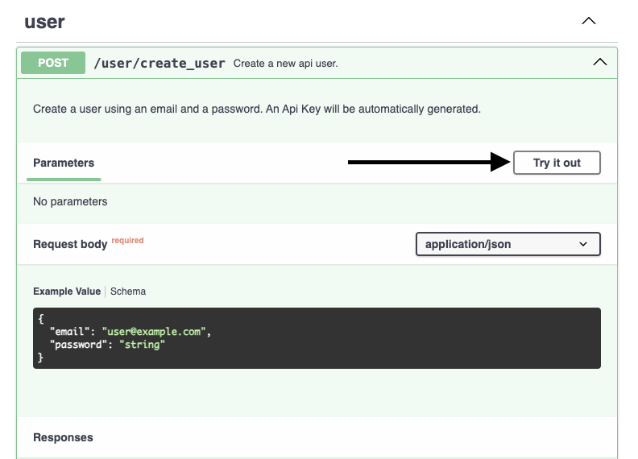
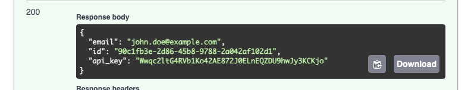
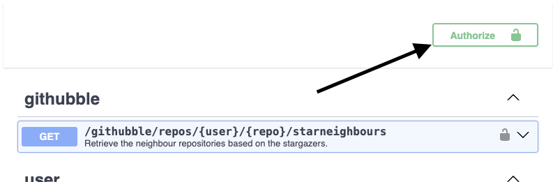

# **GitHubble**

Welcome to **GitHubble**!

## 🌟 What is GitHubble?

GitHubble is an API that helps you explore "neighbour repositories" on GitHub. It's a tool for discovering related repositories based on shared stargazers.

---

## 🧐 What are "neighbour repositories"?

We define a *neighbour repository* as follows:

> **Two repositories are neighbours if at least one user has starred both.**

For example:
- If user `joe` stars both `projectA` and `projectB`, then `projectA` and `projectB` are considered neighbours.
- The more users star both repositories, the closer the repositories are.

---

## 🚀 How to get started?

### Prerequisites:
1. **Clone this repository:**
   ```bash
   git clone https://github.com/your-username/GitHubble.git
   cd GitHubble
   ```

2. **Install Docker:**  
   Make sure Docker is installed and running on your system.

3. **Set your GitHub Token:**  
   Update the `app/.env.test` file with your `GITHUB_TOKEN`.  
   **Why?**: Without a token, the GitHub API limits requests to 60 per hour. With a token, you can make up to **5000 requests per hour**.

### Launch the API:
- Run the following command to start the stack:
   ```bash
   make launch
   ```

- Open your web browser and visit:  
  👉 **[http://127.0.0.1:8000/docs](http://127.0.0.1:8000/docs)**

---

## 🛠️ Workflow Overview

GitHubble uses an API-key-based authentication system. Here's how to get started:

### Step 1: Create a User
Use the `/user/create_user` endpoint to create an account with your email and password.  

** 💡 You can test this directly from the OpenAPI documentation interface.**

Example:
- Request:  
    

- Response (API key provided):  
    

### Step 2: Use Your API Key
- Add your API key to the `X-API-Key` header of your requests.
- If you're using the OpenAPI documentation, click on the **Authorize** button and enter your key.

Example:  


Once authenticated, you're ready to explore the stars!

---

## ✨ Explore Neighbour Repositories

The endpoint `/githubble/repos/{user}/{repo}/starneighbours` is the heart of GitHubble.  

### Parameters:
- **`user`**: GitHub username.
- **`repo`**: Repository name.
- **`max_stargazers`**: Limit the number of stargazers fetched (default: 20, max: 1000).
- **`page`**: Pagination for the results.
- **`per_page`**: Number of neighbour repositories per page.

### Example Response:
The API returns neighbour repositories sorted by the number of shared stargazers.

```json
[
  {
    "repo": "encode/uvicorn",
    "stargazers": ["user1", "user2", "user3"]
  },
  {
    "repo": "encode/apistar",
    "stargazers": ["user2", "user3"]
  }
]
```

---

## 🛠️ Technical Stack

The GitHubble architecture includes:
- **FastAPI**: For the API backend.
- **Redis**: For caching GitHub responses.
- **PostgreSQL**: For user and API key management.
- **Docker**: To containerize the entire stack.

---

## ⚡ Areas for Improvement

GitHubble is functional but can be enhanced in many ways:

1. **Efficient Caching:**
   - Current caching avoids API rate limits but lacks granularity. Smarter cache strategies could improve performance.

2. **Test Coverage:**
   - Some unit tests were autogenerated due to time constraints and could be more robust.

3. **Advanced User Management:**
   - Integrating libraries like `fastapi-users` could improve authentication and user lifecycle management.

4. **Service Scalability:**
   - User management could be decoupled into a separate service, enabling the API to scale independently.

5. **Configuration Management:**
   - Replace `.env` files with a centralized secret management system for production use.

6. **Performance Optimizations:**
   - Profiling reveals bottlenecks in the GitHub API requests. Here's a sample profiling result for 100 stargazers:
     ```
     28.726s _UnixSelectorEventLoop.run_forever
     └─ 27.033s Handle._run
         ├─ 20.552s GitHubAPI.make_request <-- Main bottleneck
         └─ 2.060s GitHubAPI.get_starred_repos_by_username
     ```
     I've improved this by limiting the number of repos fetched by user to 100 to avoid exponential growth of requests needed

7. **Asynchronous Caching:**
   - Prefetch data for known repositories in the background for faster responses.

8. **Database Lifecycle Management:**
   - Implementing Alembic for migrations would simplify schema updates.


