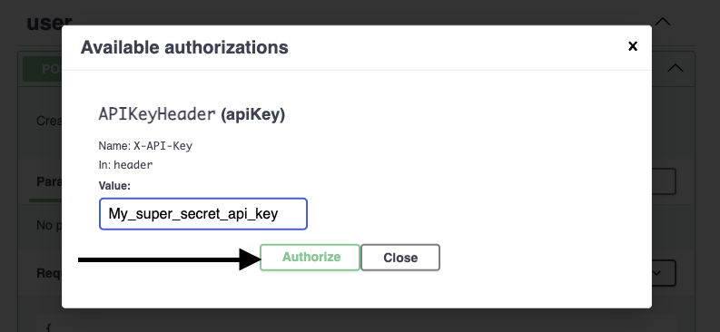

# Githubble

Welcome to GitHubble !

## What on earth is this ?
GitHubble is an API that allows you to fetch what we call "neighbours repositories" for any given Github repository.

## Ok but what is "neighbours repositories"
**We define a neighbour of a repository A as a repository B that has been starred by a same user.**

> For example, if `joe` adds a star to the repository `projectA` and `projectB`, we define those repositories `projectA` and `projectB` as being *neighbours*.
> 

Of course, the more users two projects have in common the closer they are.

## Sounds great ! How can I use it ?
It's quite simple !
- Clone this repository on your favorite working computer. **IMPORTANT: You need docker to launch the project**
- **IMPORTANT AS WELL: It's HIGHLY recommended to set a ```GITHUB_TOKEN``` in the app/.env.test file to avoid reaching the GitHub rate limit too fast. Entering a key will give you 5000 request/hour vs 60 request/hour with none.**
- In a command prompt enter ```make launch``` to create the API stack
- Open your favorite web browser and go to ```http://127.0.0.1:8000/docs```

## What is the workflow ?
Githubble uses a simple API workflow based on API key authentication. The first step is to get one of those.

**You can use the API directly through the openapi doc !**

The ```/user/create_user``` endpoint allows you to create an account with a POST, given an email and a password. We promise that you won't receive any spams


After the creation, you will receive the API Key in the response body


**Note that you can use the ```/user/authenticate``` endpoint to retrieve your api key if you lose it**

Now that you have your precious API Key, you need to set it in the header of your requests in the ``` X-API-Key``` field.

If you use the openapi doc, you need to enter your API Key in the ``Àuthorize`` screen at the top




## I'm set ! I want to see the stars !
The ```/githubble/repos/{user}/{repo}/starneighbours``` endpoint is the meat of this API. Here are the parameters:
- **user**: The Github username.
- **repo**: The repo name
- **max_stargazers**: Only collect a limited amount of stargazers for the given repo.
- **page**: The current result page
- **per_page**: The number of neighbour repos per page

The response will give you the list of neighbour repositories containing a list of stargazers found in the requested repository.
The list is ordered by the amount of common stargazers:

```
[
  {
    "repo": "encode/uvicorn",
    "stargazers": [
      "tihomirptotev",
      "Koomook",
      "pratos",
      "jhermann",
      "woile",
      "podhmo",
      "headsrooms",
      "jordaneremieff",
      "mbarkhau",
      "Gr1N",
      "thedrow",
      "fracaron",
      "py7hon",
      "laith43d"
    ]
  },
  {
    "repo": "encode/apistar",
    "stargazers": [
      "nkonin",
      "pratos",
      "jhermann",
      "oroszgy",
      "woile",
      "headsrooms",
      "jordaneremieff",
      "mbarkhau",
      "Gr1N",
      "checkaayush",
      "thedrow",
      "fracaron",
      "laith43d"
    ]
  },
  {
    "repo": "fastapi/typer",
    "stargazers": [
      "tihomirptotev",
      "jhermann",
      "oroszgy",
      "woile",
      "mariacamilagl",
      "headsrooms",
      "jordaneremieff",
      "mbarkhau",
      "Gr1N",
      "thedrow",
      "danielfrg",
      "fracaron",
      "laith43d"
    ]
  }
]
```

## Awesome, but how does it work under the hood ?

The technical stack of this API is :
- A FastApi app running on a docker image
- A redis server running on another docker image for caching purpose
- A PostgresSQL server running on a third docker image for the user management

## I see ! And is this API absolutely perfect ?

Of course !.....Not !

Here are some of the many areas of improvements :

- **More efficient caching system**: I've implemented a simple cache functionnality to avoid reaching the GitHub rate limit, but it could be more granular and more flexible
- **Better Test Coverage**: I admit that I auto generate quite a lot of unit tests to be able to finish this project on the time frame I had available. Those could be improved.
- **Better user management**: The user management I've develop here is quite straight forward. It can be improved with more complex authentication handling (using the fastapi-user library for example)
- **The user management could be separated**: On a real environnement the user functionnality could be a service outside the api. The token could then be validated by an API gateway for example. This would allow the API to be easily scalable.
- **Better config and secret management**: For this test i've used a straigh forward setting configuration based on an .env file. Using a proper secret management would be mandatory in a production environnement
- **Better performances**: The api can be quite slow for big requests. I've used asyncio to do multiple requests at the same time but this could be greatly improved.
- **Asynchronous stargazers caching**: It could be interesting to create asynchronous tasks to pre-fetch the data from already known repositories on a full fledge system
- **Better database lifecycle management**: The use of alembic could greatly improve the database life cycle if the user table needs to be change or new tables added at some point